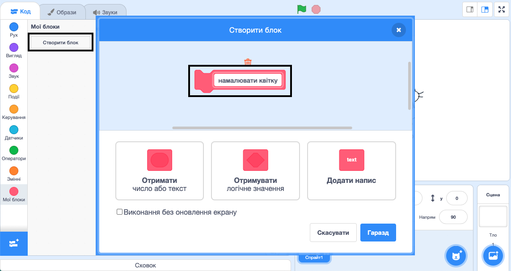

## Створи власний блок для малювання квітів

Що робити, якщо ти хочеш намалювати багато квітів? Замість того, щоб робити багато копій якогось коду, ти створиш свій власний блок в Скретч і будеш його використовувати кожного разу, коли захочеш намалювати квітку.

\--- task \---

Клацни на **Мої блоки**, а далі на **Створити блок**, щоб створити власний блок із назвою "намалювати квітку".



\--- /task \---

\--- task \---

Тепер в розділі **Мої блоки** з’явився блок `намалювати квітку`{:class="block3myblocks"}, а в області коду — місце для його визначення.

```blocks3
draw flower :: custom

define draw flower
```

\--- /task \---

\--- task \---

Перенеси свій код малювання квітки з-під блоку `коли зелений прапор натиснуто`{:class="block3events"} під визначення нового блоку `намалювати квітку`{:class="block3myblocks"}.

Твій код повинен виглядати так:


```blocks3
define draw flower
repeat (6) 
  stamp
  turn cw (60) degrees
end

when green flag clicked
```

\--- /task \---

\--- task \---

Додай наступний код, щоб очистити Сцену і застосувати твій новий блок `намалювати квітку`{:class="block3myblocks"}, коли натиснуто на зелений прапор:


```blocks3
when green flag clicked
erase all
draw flower :: custom
```

\--- /task \---

\--- task \---

Клацни на зелений прапор, щоб протестувати свій код, і перевір, чи бачиш ти квітку.

\--- /task \---

\--- task \---

Тепер зміни свій код, щоб перемістити спрайт, а потім намалюй ще одну квітку:


```blocks3
when green flag clicked
erase all
go to x: (75) y: (75)
draw flower :: custom
go to x: (-75) y: (-75)
draw flower :: custom 
```

\--- /task \---

\--- task \---

Перевір свій код і впевнись, що ти бачиш дві квітки.


\--- /task \---