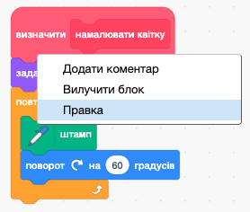
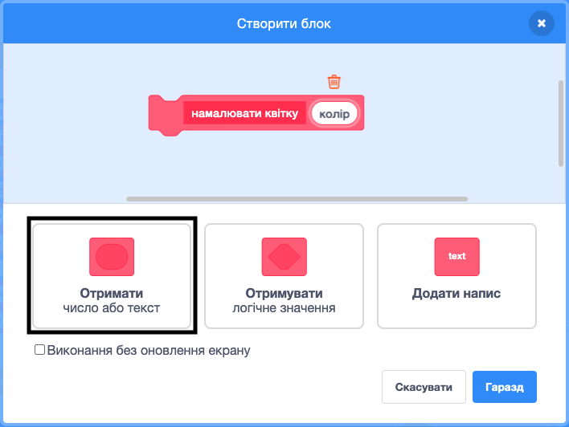
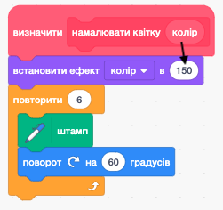

## Налаштуй свої квіти

Наразі усі намальовані тобою квіти абсолютно однакові. Далі ти додаси деякі параметри до блоку `намалювати квітку`{:class="block3myblocks"}, щоб можна було малювати квіти різних кольорів, розмірів та з різною кількістю пелюсток.

--- task ---

В Скретч можна використовувати блок `встановити ефект колір`{:class="block3looks"}, щоб змінювати колір спрайтів.

Зміни визначення "намалювати квітку", щоб змінювати її колір:


```blocks3
define намалювати квітку
set [color v] effect to (150)
repeat (6) 
  stamp
  turn cw (60) degrees
end
```

--- /task ---

--- task ---

Запусти свй код, щоб побачити квіти іншого кольору.


`встановити ефект колір`{:class="block3looks"} змінює колір на основі початкового кольору спрайта, тому якщо твій спрайт спочатку не був оранжевим, ти побачиш інший результат.

--- /task ---

--- task ---

Поекспериментуй з різними числами від `0` до `199` в блоці `встановити ефект колір`{:class="block3looks"}, щоб побачити, які результати ти можеш отримати.

--- /task ---

Зараз усі квіти мають однаковий колір. Щоб надати квітам різних кольорів, тобі треба додати **параметр** до блока `намалювати квітку`{:class="block3myblocks"}.

--- task ---

Клацни правою кнопкою мишки на визначення блока `намалювати квітку`{:class="block3myblocks"} і вибери **правка**:



--- /task ---

--- task ---

Тепер додай **числовий параметр** з назвою "колір":



Цей параметр з’явиться у визначенні `намалювати квітку`{:class="block3myblocks"}, і ти зможеш перетягувати його в будь-яке місце для використання.

--- /task ---

--- task ---

Перетягни параметр "колір" в блок `встановити ефект колір`{:class="block3looks"}:



Твій код повинен виглядати так:


```blocks3
define намалювати квітку (колір)
set [color v] effect to (колір :: custom-arg)
repeat (6)
  stamp
  turn cw (60) degrees
end
```

--- /task ---

Зверни увагу, що тепер твої блоки `намалювати квітку`{:class="block3myblocks"} мають новий параметр зі значенням `1`:

```blocks3
when green flag clicked
erase all
go to x: (75) y: (75)
намалювати квітку (1) :: custom
go to x: (-75) y: (-75)
намалювати квітку (1) :: custom
```

--- task ---

Зміни числа в блоках `намалювати квітку`{:class="block3myblocks"}, щоб дві квітки були різних кольорів. Ти можеш вибрати будь-які числа між 0 та 200.

Твій код виглядатиме якось так:


```blocks3
when green flag clicked
erase all
go to x: (75) y: (75)
намалювати квітку (180) :: custom
go to x: (-75) y: (-75)
намалювати квітку (150) :: custom
```

--- /task ---

--- task ---

Тепер додай іще один параметр, щоб задавати розмір квітки, а отже твій блок `намалювати квітку`{:class="block3myblocks"} виглядатиме так:


```blocks3
намалювати квітку (180) (150) :: custom
```

За допомогою вищенаведеного блоку ти можеш створювати квіти різних розмірів:


--- hints ---


--- hint ---

Поглянь, що ти зробив (-ла) для того, щоб додати параметр `колір`, і повтори ті ж кроки для параметра "розмір", який знадобиться, щоб задавати розмір спрайта Квітка.

--- /hint ---

--- hint ---

Зміни блок `намалювати квітку`{:class="block3myblocks"}, щоб додати новий числовий параметр із назвою "розмір".

Тобі треба буде додати наступний блок з параметром "розмір" у визначення блоку `намалювати квітку`{:class="block3myblocks"}:

```blocks3
set size to (100) %
```

--- /hint ---

--- hint ---

Клацни правою кнопкою мишки на визначення блоку `намалювати квітку`{:class="block3myblocks"}, далі вибери **правка** і додай числовий параметр із назвою "розмір".


Зміни скрипт `визначити намалювати квіту`{:class="block3myblocks"}, щоб він виглядав таким чином:

```blocks3
define намалювати квітку (колір) (розмір :: custom-arg)
set [color v] effect to (колір :: custom-arg)
set size to (розмір :: custom-arg) %
repeat (6) 
  stamp
  turn cw (60) degrees
end
```

--- /hint ---

--- /hints ---

--- /task --- --- task ---

В скрипті `коли зелений прапор натистнуто`{:class="block3events"} зміни друге число в обох блоках `намалювати квітку`{:class="block3myblocks"}, щоб обидві квітки стали різних розмірів.

```blocks3
when green flag clicked
erase all
go to x: (75) y: (75)
намалювати квітку (180) (150) :: custom
go to x: (-75) y: (-75)
намалювати квітку (150) (50) :: custom
```

--- /task ---

--- task ---

Протестуй свій код, щоб переконатися, що квіти мають різні розміри.

--- /task ---

--- task ---

Було би класно змінювати кількість пелюсток квітів.

Додай іще один параметр, щоб ти міг (могла) малювати такі квіти:


--- hints ---
 --- hint ---

Тобі потрібно додати числовий параметр "пелюстки", а далі використати його в блоці `визначити намалювати квітку`{:class="block3myblocks"}.

Існує два місця, де тобі треба буде використати параметр "пелюстки".

Кількість градусів, на які повинен `повернути`{:class="block3looks"} спрайт Квітка, складатиме `360`, розділене на кількість пелюсток.

--- /hint ---

--- hint ---

Зміни свій блок `визначити намалювати квітку`{:class="block3myblocks"}, щоб він виглядав таким чином:


```blocks3
define намалювати квітку (колір) (розмір :: custom-arg) (petals)
```

Онови свої блоки `повторити`{:class="block3control"} та `поворот`{:class="block3looks"}, щоб вони використовували "пелюстки" як параметр.

```blocks3
repeat (пелюстки :: custom-arg) 
end

turn cw ((360) / (пелюстки :: custom-arg)) degrees
```

Онови свої блоки `намалювати квітку`{:class="block3myblocks"}, щоб вони використовували параметр "пелюстки".

```blocks3
намалювати квітку (150) (50) (8) :: custom
```

--- /hint ---

--- hint ---

Зміни свій блок `визначити намалювати квітку`{:class="block3myblocks"}, додавши новий параметр з назвою "пелюстки".


Твій код повинен виглядати так:

```blocks3
define намалювати квітку (пелюстки) (розмір :: custom-arg) (пелюстки)
set [color v] effect to (пелюстки :: custom-arg)
set size to (розмір :: custom-arg) %
repeat (пелюстки :: custom-arg) 
  stamp
  turn cw ((360) / (пелюстки :: custom-arg)) degrees
end

```

В скрипті `коли зелений прапор натиснуто`{:class="block3events"} зміни третє число в обох блоках `намалювати квітку`{:class="block3myblocks"}, щоб квіти мали різну кількість пелюсток.

```blocks3
when green flag clicked
erase all
go to x: (75) y: (75)
намалювати квітку (180) (150) (3) :: custom
go to x: (-75) y: (-75)
намалювати квітку (150) (50) (8) :: custom
```

--- /hint ---

--- /hints ---

--- /task ---

Далі, зміни свій код, щоб ти міг (могла) малювати різні квіти по натисканню клавіші <kbd>f</kbd>.

--- task ---

Перенеси свій код для малювання квітів з-під блоку `коли зелений прапор натиснуто`{:class="block3events"} під блок `коли клавішу f натиснуто`{:class="block3events"}.


```blocks3
when green flag clicked
```

```blocks3
when [f v] key pressed
erase all
go to x: (75) y: (75)
намалювати квітку (180) (150) (3) :: custom
go to x: (-75) y: (-75)
намалювати квітку (150) (50) (8) :: custom
```

--- /task ---

--- task ---

Натисни <kbd>f</kbd>, щоб протестувати свій код.

--- /task ---

--- task ---

Додай іще кілька блоків `намалювати квітку`{:class="block3myblocks"} до своєї програми, щоб намалювати по всій Сцені квіти різних кольорів, розмірів та з різним числом пелюсток.

--- /task ---