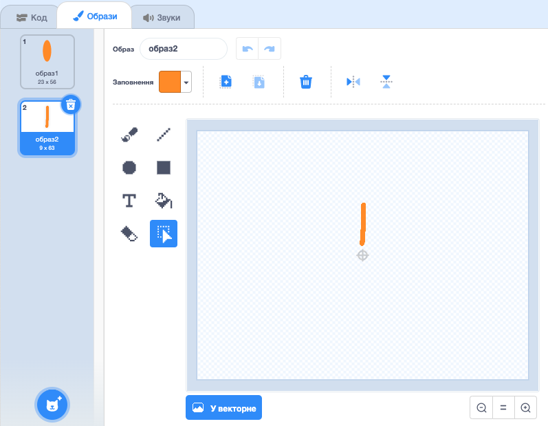

## Завдання: створи власний квітковий малюнок

Чи можеш ти використати свій блок `намалювати квітку`{:class="block3myblocks"} декілька разів, щоб зобразити багато квітів і створити цікавий малюнок? Малювання різних квітів в одному й тому ж місці створює цікавий ефект.

Створи малюнок, який тобі подобається. Ось приклад:

Тобі не обов’язково використовувати пелюстки в формі еліпсів. Наприклад, ти можеш використовувати товсті прямі лінії і чорне тло, щоб створити ось такий візерунок у формі феєрверків:

"Пелюсткою" для візерунка у формі феєрверків є звичайна лінія:

Додай нові образи пелюсток, щоб побачити, які квіти в тебе вийдуть.

Спробуй використати форму спрайта без заливки, наприклад, квадрат, і подивись, що вийде.

