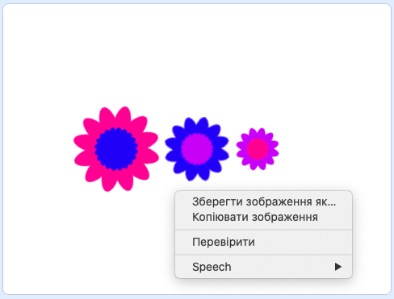

## Збережи свої зображення

Коли ти створиш зображення, яке тобі подобається, ти можеш його зберегти, щоб використовувати в інших проєктах Скретч або як заставку на екран, або на якомусь вебсайті.

\--- task \---

Коли на Сцені є зображення, яке тобі подобається, клацни на ньому правою кнопкою мишки і вибери **зберегти зображення як**

**Примітка:** на інших комп’ютерах або браузерах пункт меню для збереження зображення може називатися по-іншому.

Далі ти можеш зберегти зображення сцени в форматі PNG.

\--- /task \---