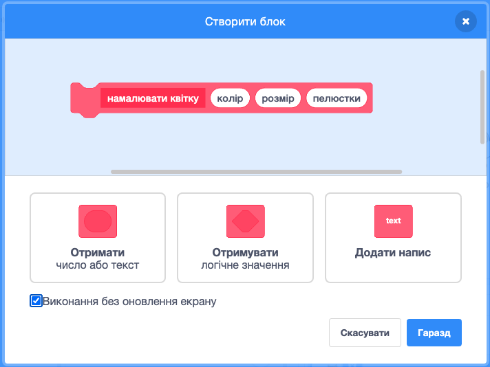
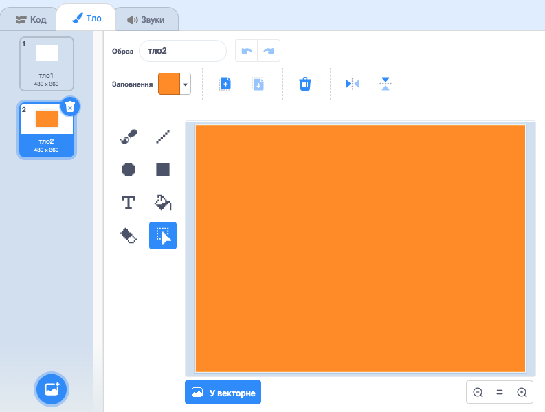
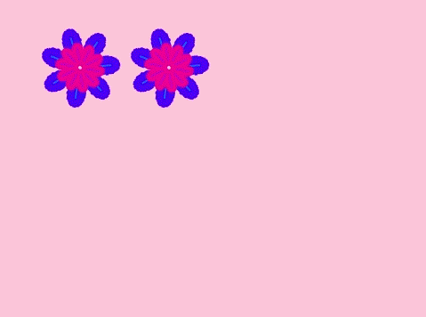

## Квіткові візерунки

Ти також можеш використовувати свій блок `намалювати квітку`{:class="block3myblocks"}, щоб створювати гарні квіткові візерунки.

\--- task \---

Намалюй квітку або комбінацію квітів, яка тобі подобається. Ось приклад:


```blocks3
when [p v] key pressed
erase all
go to x: (-150) y: (100)
draw flower (150) (80) (7) :: custom
draw flower (130) (35) (20) :: custom
```

\--- /task \---

\--- task \---

Щоб побачити свою квітку, натисни <kbd>p</kbd>. Цей приклад виглядає ось так:


\--- /task \---

Перед тим, як ти будеш створювати власний візерунок, треба очистити Сцену від усіх квітів, що на ній залишилися.

\--- task \---

Клацни на блок `очистити все` у вкладці Олівець.

```blocks3
erase all
```

\--- /task \---

\--- task \---

Клацни правою кнопкою по спрайту Квітка і `сховай`{:class="block3looks"} його, щоб він не відображався на Сцені. (Ти можеш `показати`{:class="block3looks"} спрайт знову, якщо тобі треба побачити, де він знаходиться.)

\--- /task \---

\--- task \---

Тепер намалюй рядок квітів зверху Сцени. Ось зразок коду, в якому тобі може бути потрібно змінити числа, щоб він підходив для твоєї квітки:


```blocks3
when [p v] key pressed
erase all
go to x: (-150) y: (100)
repeat (4) 
  draw flower (150) (80) (7) :: custom
  draw flower (130) (35) (20) :: custom
  change x by (100)
end
```

\--- /task \---

\--- task \---

Натисни `p`, щоб побачити рядок квітів:


\--- /task \---

\--- task \---

Додай ще один цикл, щоб створити більше рядків із квітів. Наступний приклад додає цикл `повторити 3`{:class="block3control"}, щоб намалювати три рядки.


```blocks3
when [p v] key pressed
erase all
go to x: (-150) y: (100)
repeat (3) 
  repeat (4) 
    draw flower (150) (80) (7) :: custom
    draw flower (130) (35) (20) :: custom
    change x by (100)
  end
  set x to (-150)
  change y by (-100)
end
```

\--- /task \---

\--- task \---

Натисни <kbd>p</kbd>, щоб створити сітку із квітів:


\--- /task \---

Чи хочеш ти прискорити малювання квітів?

\--- task \---

Клацни правою кнопкою мишки по визначенню блока `намалювати квітку`{:class="block3myblocks"} та вибери **правка**. Клацни на квадратик **Виконання без оновлення екрану**.



Тепер квіти малюються швидше.

\--- /task \---

Ти також можеш змінити колір Сцени.

\--- task \---

Клацни на **Обрати тло**, а далі — **Намалювати**. Створи оранжеве тло за допомогою інструмента Заповнення у растровому режимі.



Якщо ти використовуєш оранжевий колір і для тла, і для спрайта Квітка, тоді числа для різних кольорів будуть для них збігатися.

\--- /task \---

\--- task \---

Тепер ти можеш використати `встановити ефект колір`{:class="block3looks"} для Сцени, щоб змінити колір тла.


```blocks3
when [p v] key pressed
set [color v] effect to (30)
```

\--- /task \---

\--- task \---

Спробуй створити візерунок, який тобі подобається.

Наприклад:


\--- /task \---

Коли ти збереш усе до купи, то можеш створити чудовий ефект:

