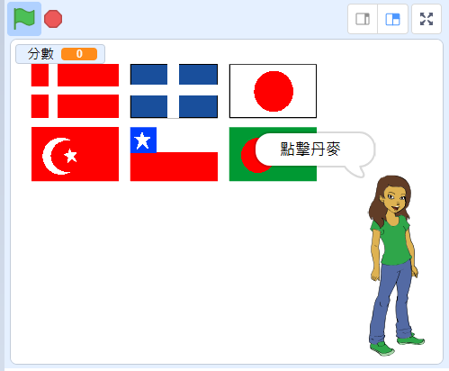

## 接下來是什麼？

試試[猜國旗](https://projects.raspberrypi.org/zh-TW/projects/guess-the-flag?utm_source=pathway&utm_medium=whatnext&utm_campaign=projects)專案，做個國旗測驗，考考自己和你的朋友。

--- no-print ---

點擊你被問到的國家的國旗。

  <iframe allowtransparency="true" width="485" height="402" src="https://scratch.mit.edu/projects/embed/276891625/?autostart=false" frameborder="0" scrolling="no"></iframe>

--- /no-print ---

--- print-only ---

--- /print-only ---

***
這個專案由以下志工翻譯：

Jiashian Peng

陳治維

感謝志工們，我們才能為來自世界各地的人們提供學習機會。你也可以擔任翻譯志工，幫我們創造更多機會，若要進一步瞭解，請造訪 [rpf.io/translate](https://rpf.io/translate)。