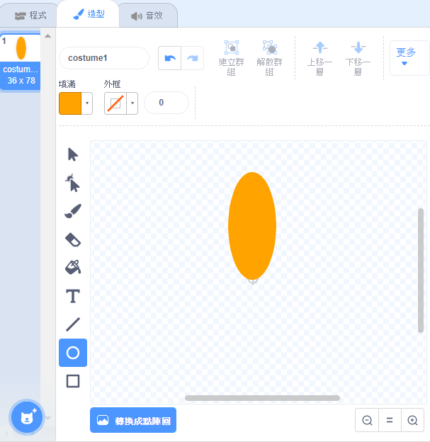
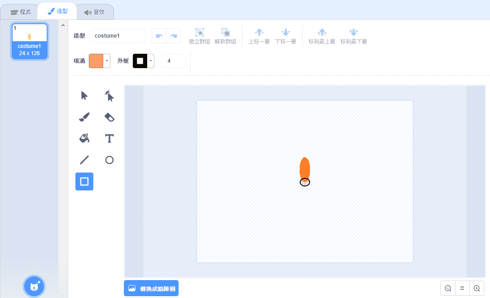

## 創造一朵花

首先，創造一朵可以在"舞台"上繪製的花朵。

\--- task \---

新建一個新的Scratch專案，然後刪除貓咪角色。

[[[generic-scratch3-new-project]]]

\--- /task \---

\--- task \---

把畫筆這個擴充功能添加到專案裡。

[[[generic-scratch3-add-pen-extension]]]

\--- /task \---

\--- task \---

現在使用"繪畫"工具來創造形狀如同花瓣的新角色。

點擊**選擇角色** ，接著點擊**繪畫**並將角色重新命名為“花朵”。

[[[generic-scratch3-draw-sprite]]]

\--- /task \---

\--- task \---

使用圓形工具來畫出一個橘色的實心花瓣形狀。



接下來，你將會使用程式碼來新增更多色彩。

\--- /task \---

\--- task \---

新增以下程式碼使 `當綠色旗子被點擊時`{:class="block3control"}，用花瓣角色`蓋章`{:class="block3extensions"}成一朵有著六片同旋轉角度花瓣的花朵


```blocks3
when green flag clicked
repeat (6) 
  stamp
  turn cw (60) degrees
end
```

\--- /task \---

你可能會發現花瓣的排列方式很奇怪：


這是因為角色會繞中心旋轉。

\--- task \---

移動你的花瓣，使其底部位於中央。



縮小的話可能會比較容易操作。

\--- /task \---

在重新跑程式碼之前, 記得用`筆跡全部清除`{:class="block3extensions"} 來清理舞台上的角色。

\--- task \---

點擊畫筆欄位的 `筆跡全部清除` 積木。

```blocks3
erase all
```

\--- /task \---

\--- task \---

再跑一次程式碼，檢查看看花朵的花瓣是不是都正常了。


如果還是怪怪的，調整花瓣角度直到它的底部在正中央。

\--- /task \---