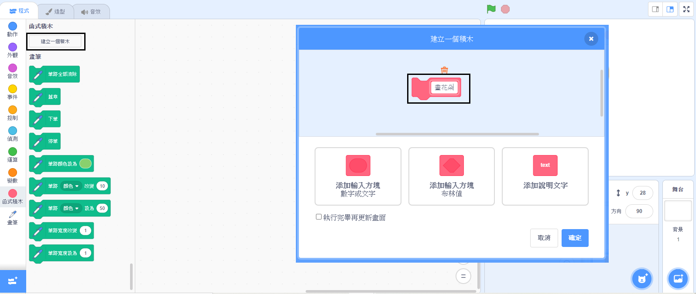

## 製作一個畫花朵的專屬積木

如果要畫很多花的時候該怎麼辦呢？ 為了避免複製很多程式碼，你可以在Scratch中創造專屬你的積木，每當要畫花朵時就可以使用它。

--- task ---

點擊 **函式積木**，再點擊 **建立一個積木** 創造你專屬的積木並取名為「畫花朵」。



--- /task ---

--- task ---

現在會有一個名為`畫花朵`{:class="block3myblocks"} 的新積木在 **函式積木** 下，和一個新的定義積木在舞台上。

```blocks3
畫花朵 :: custom

define 畫花朵
```

--- /task ---

--- task ---

移動畫花朵的程式碼，將它們從 `當綠色旗子被點擊時`{:class="block3events"} 積木下移動到 `畫花朵`{:class="block3myblocks"} 定義積木下。

你的程式應該會像這樣：


```blocks3
define 畫花朵
repeat (6) 
  stamp
  turn cw (60) degrees
end

when green flag clicked
```

--- /task ---

--- task ---

新增下列程式碼：當綠色旗子被點擊時，先清除舞台然後運行你的`畫花朵`{:class="block3myblocks"} 積木。


```blocks3
when green flag clicked
erase all
畫花朵 :: custom
```

--- /task ---

--- task ---

點擊綠色旗子，測試你的程式碼，看看是不是能看到花朵。

--- /task ---

--- task ---

現在更改你的程式碼，來移動角色並畫一朵花。


```blocks3
when green flag clicked
erase all
go to x: (75) y: (75)
畫花朵 :: custom
go to x: (-75) y: (-75)
畫花朵 :: custom 
```

--- /task ---

--- task ---

測試你的程式碼，看看能不能看到兩朵花。


--- /task ---