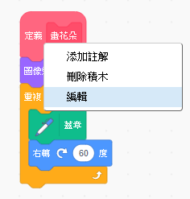
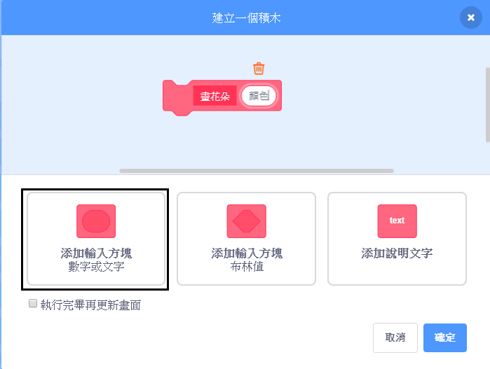
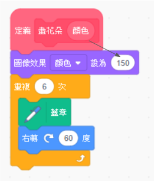

## 自訂您的花朵

目前為止，你畫的花都是一模一樣的。 接下來你要新增一些"輸入"到 `花朵積木`{:class="block3myblocks"}，這樣一來你就可以畫出不同顏色、大小和花瓣數的花。

\--- task \---

在Scratch中，你可以使用`圖像效果-顏色` {：class =“ block3looks”}積木來更改角色的顏色。

變更"畫花朵"定義積木來改變顏色：


```blocks3
define draw flower
set [color v] effect to (150)
repeat (6) 
  stamp
  turn cw (60) degrees
end
```

\--- /task \---

\--- task \---

執行程式碼，看看花朵是不是變成了不同的顏色。


`圖像效果-顏色` {：class =“ block3looks”}會根據原本角色設定的顏色來更改色彩，所以如果你的角色一開始不是設定成橘色，則會得到不同的結果。

\--- /task \---

\--- task \---

實驗看看在`圖像效果-顏色` {：class =“ block3looks”}積木裡使用從` 0 `到` 199 `的不同數字，看看會得到什麼結果。

\--- /task \---

目前為止，所有花都是相同顏色。 要給每朵花不同的顏色，你需要新增**輸入**到`畫花朵` {：class =“ block3myblocks”}積木。

\--- task \---

在`畫花朵` {：class =“ block3myblocks”}定義積木上點擊右鍵並選擇**編輯 ** ：



\--- /task \---

\--- task \---

添加**輸入方塊**並命名為“顏色”：



The input appears in the `draw flower`{:class="block3myblocks"} definition, and you can drag it to where you want to use it.

\--- /task \---

\--- task \---

將“顏色”輸入拖到`圖像效果-顏色` {：class =“ block3looks”}積木：



你的程式應該會像這樣：


```blocks3
define draw flower (colour)
set [color v] effect to (colour :: custom-arg)
repeat (6)
  stamp
  turn cw (60) degrees
end
```

\--- /task \---

你將注意到你的`畫花朵` {：class =“ block3myblocks”}積木現在有一個新"輸入"，該輸入設定為` 1 ` ：

```blocks3
when green flag clicked
erase all
go to x: (75) y: (75)
draw flower (1) :: custom
go to x: (-75) y: (-75)
draw flower (1) :: custom
```

\--- task \---

更改`畫花朵` {：class =“ block3myblocks”}積木中的數字，如此一來這兩朵花會呈現不同的顏色。 你可以選擇0到200之間的任何數字。

你的程式碼應該會看起來像這樣：


```blocks3
when green flag clicked
erase all
go to x: (75) y: (75)
draw flower (180) :: custom
go to x: (-75) y: (-75)
draw flower (150) :: custom
```

\--- /task \---

\--- task \---

現在添加另一個"輸入"來設定花朵的大小，你的`畫花朵` {：class =“ block3myblocks”}積木會看起來如下：


```blocks3
draw flower (180) (150) :: custom
```

使用上面的積木，你可以做出不同大小的花朵：


\--- hints \---

\--- hint \---

看著你新增`顏色`輸入的過程，並重複同樣的操作來新增一個“大小”輸入，以用來設定花朵角色的大小。

\--- /hint \---

\--- hint \---

編輯`畫花朵` {：class =“ block3myblocks”}積木，新增一個數字輸入並將它命名為“ 大小”。

你需要將“大小”輸入積木加入`畫花朵` {：class =“ block3myblocks”}定義積木：

```blocks3
set size to (100) %
```

\--- /hint \---

\--- hint \---

在`畫花朵` {：class =“ block3myblocks”}定義積木上點擊右鍵，單擊**編輯** ，並添加一個名為“ 大小”的數字輸入。


將你的`定義 - 畫花朵` {：class =“ block3myblocks”}的腳本改成如下的樣子：

```blocks3
define draw flower (colour) (size :: custom-arg)
set [color v] effect to (colour :: custom-arg)
set size to (size :: custom-arg) %
repeat (6) 
  stamp
  turn cw (60) degrees
end
```

\--- /hint \---

\--- /hints \---

\--- /task \--- \--- task \---

在`當綠色旗子被點擊時` {：class =“ block3events”}的腳本中，更改兩個`畫花朵` {：class =“ block3myblocks”}積木中的第二個數字，這樣兩朵花就會呈現不同的大小。

```blocks3
when green flag clicked
erase all
go to x: (75) y: (75)
draw flower (180) (150) :: custom
go to x: (-75) y: (-75)
draw flower (150) (50) :: custom
```

\--- /task \---

\--- task \---

測試你的程式碼，看看花朵是否呈現不同的大小。

\--- /task \---

\--- task \---

如果能選擇花朵的花瓣數的話就更酷了。

新增另一個"輸入"，讓你可以像這樣繪製花朵：


\--- hints \--- \--- hint \---

你需要添加一個“花瓣數”的輸入，然後把它用在`畫花朵` {：class =“ block3myblocks”}定義積木中。

你需要在這兩個地方加入“花瓣數”輸入。

花朵角色的`旋轉度數` {：class =“ block3looks”}是` 360 `除以花瓣數量。

\--- /hint \---

\--- hint \---

將你的`畫花朵` {：class =“ block3myblocks”}定義積木改成如下的樣子：


```blocks3
define draw flower (colour) (size :: custom-arg) (petals)
```

更新`重複`{:class="block3control"} 和 `旋轉`{:class="block3looks"} 積木，讓它們使用"花瓣數"輸入。

```blocks3
repeat (petals :: custom-arg) 
end

turn cw ((360) / (petals :: custom-arg)) degrees
```

更新你的`畫花朵` {：class =“ block3myblocks”}積木以讓它使用“花瓣數”輸入。

```blocks3
draw flower (150) (50) (8) :: custom
```

\--- /hint \---

\--- hint \---

編輯`定義 - 畫花朵` {：class =“ block3myblocks”}積木，新增一個數字輸入並將它命名為“ 花瓣數”。


你的程式應該會像這樣：

```blocks3
define draw flower (colour) (size :: custom-arg) (petals)
set [color v] effect to (colour :: custom-arg)
set size to (size :: custom-arg) %
repeat (petals :: custom-arg) 
  stamp
  turn cw ((360) / (petals :: custom-arg)) degrees
end

```

在`當綠色旗子被點擊時` {：class =“ block3events”}的腳本中，更改兩個`畫花朵` {：class =“ block3myblocks”}積木中的第三個數字，這樣兩朵花就會呈現不同的花瓣數。

```blocks3
when green flag clicked
erase all
go to x: (75) y: (75)
draw flower (180) (150) (3) :: custom
go to x: (-75) y: (-75)
draw flower (150) (50) (8) :: custom
```

\--- /hint \---

\--- /hints \---

\--- /task \---

接下來，編輯程式碼，讓你按<kbd> f</kbd>鍵就可以繪製不同的花朵。

\--- task \---

現在，將程式碼從`當綠色旗子被點擊` {：class =“ block3events”}積木下移開，並將程式碼放到`當f鍵被按下` {：class =“ block3events”}積木底下。


```blocks3
when green flag clicked
```

```blocks3
when [f v] key pressed
erase all
go to x: (75) y: (75)
draw flower (180) (150) (3) :: custom
go to x: (-75) y: (-75)
draw flower (150) (50) (8) :: custom
```

\--- /task \---

\--- task \---

Press <kbd>f</kbd> to test your code.

\--- /task \---

\--- task \---

Add more `draw flower`{:class="block3myblocks"} blocks to your program to draw flowers with different colours, sizes, and numbers of petals all over the Stage.

\--- /task \---