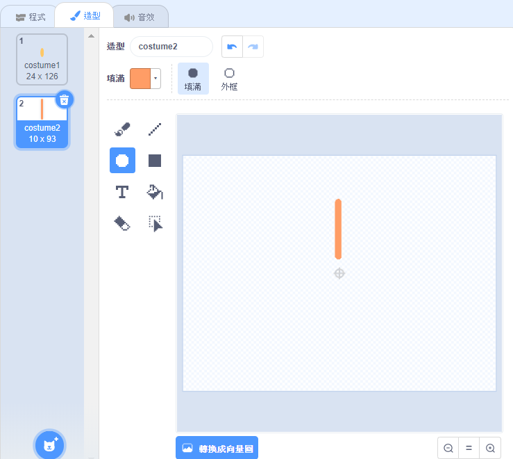

## 挑戰：設計花朵

你有辦法使用你的`畫花朵`{:class="block3myblocks"}積木多次以創造出有趣的設計嗎？ 在同一位置繪製不同的花朵來產生有趣的效果。

創造出你喜歡的設計。 範例如下：

你不一定要使用形狀像橢圓形的花瓣。 例如，你可以使用粗直線和黑色背景來創造如下煙火圖案：

煙火的“花瓣”只是一條線：

新增新的花瓣造型，看看你能畫出什麼樣的花。

試看看用不填滿顏色的形狀角色（例如正方形），看看會發生什麼。

