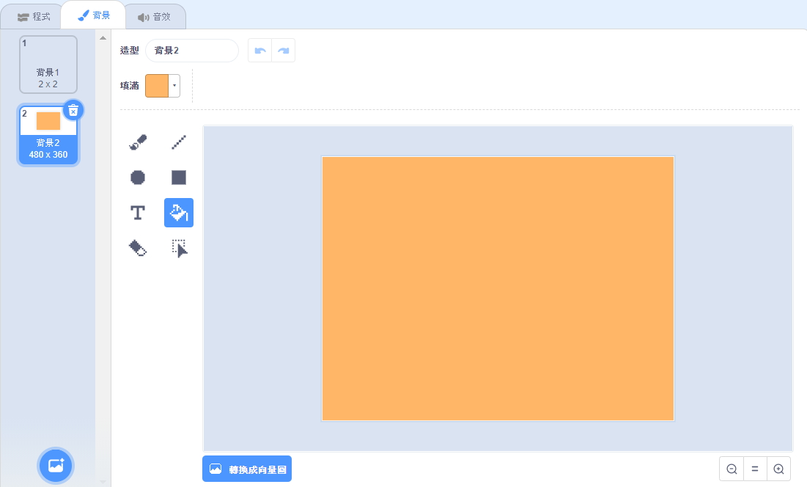

## 花朵圖案

你還可以使用你的`畫花朵`{:class="block3myblocks"}積木創造出整齊的花朵圖案。

--- task ---

創造一個你喜歡的花朵或花朵組合。 範例如下：


```blocks3
when [p v] key pressed
erase all
go to x: (-150) y: (100)
畫花朵 (150) (80) (7) :: custom
畫花朵 (130) (35) (20) :: custom
```

--- /task ---

--- task ---

按<kbd>p</kbd>看看你創造的花朵。 範例看起來如下：


--- /task ---

在創造圖案之前，應清除所有留在舞台上的花朵。

--- task ---

點擊畫筆欄位的 `筆跡全部清除` 積木。

```blocks3
erase all
```

--- /task ---

--- task ---

在花朵角色上點擊右鍵並`隱藏`{:class="block3looks"}它，這樣它就不會出現在舞台上。 （如果需要查看角色，你可以`顯示`{:class="block3looks"}角色。）

--- /task ---

--- task ---

現在在舞台上方繪製一排花。 這裡有一些範例程式碼，你可能需要調整數字，讓它能配合你的花朵：


```blocks3
when [p v] key pressed
erase all
go to x: (-150) y: (100)
repeat (4) 
  畫花朵 (150) (80) (7) :: custom
  畫花朵 (130) (35) (20) :: custom
  change x by (100)
end
```

--- /task ---

--- task ---

按`p`看看你創造的一排花朵。


--- /task ---

--- task ---

新增一個迴圈來創造更多排花朵。 這個範例會新增 `重複3次`{:class="block3control"} 的迴圈來畫出三排花朵。


```blocks3
when [p v] key pressed
erase all
go to x: (-150) y: (100)
repeat (3) 
  repeat (4) 
    畫花朵 (150) (80) (7) :: custom
    畫花朵 (130) (35) (20) :: custom
    change x by (100)
  end
  set x to (-150)
  change y by (-100)
end
```

--- /task ---

--- task ---

按<kbd>p</kbd>來畫出網格狀排列花朵。


--- /task ---

想要加快畫花的速度嗎？

--- task ---

在`畫花朵`{:class="block3myblocks"}定義積木上點擊右鍵並選擇**編輯** ： 勾選 **執行完畢再更新畫面**。


現在花畫得更快了。

--- /task ---

你還可以更改舞台的顏色。

--- task ---

點擊**選個背景** ，然後單擊**繪畫** 。 在點陣圖模式中使用"填滿"工具來製作一個橘色的背景。



如果你的背景和花朵角色都是用橘色，那麼背景和花朵角色的色彩編碼將會一致。

--- /task ---

--- task ---

現在你可以使用`圖像效果-顏色`{:class="block3looks"}積木來更改背景的顏色。


```blocks3
when [p v] key pressed
set [color v] effect to (30)
```

--- /task ---

--- task ---

試著畫出你喜歡的圖案。

範例如下：


--- /task ---

當你將所有東西組合在一起，你可以創造出驚人的效果：

